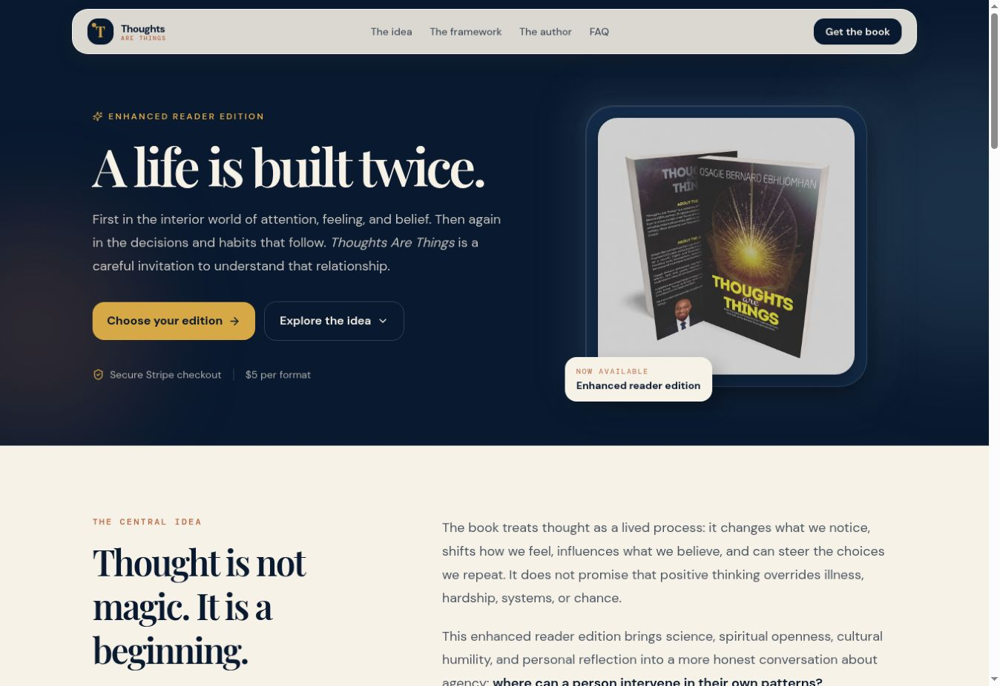
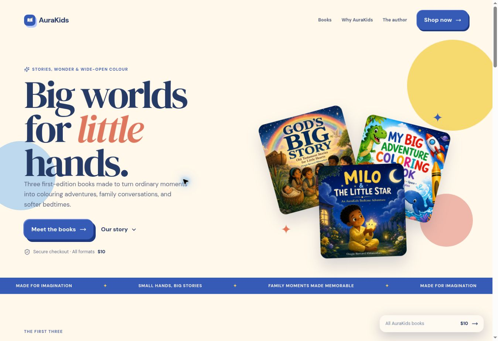

# Book storefront migration verification — 2026-10-05

The migrated pages display the original storefronts and use the original Stripe and digital fulfillment backends.

| Storefront | Public upstream | Browser result | Stripe checkout | Callback result |
|---|---|---|---|---|
| Beyond The Machine | beyond-the-machine-book.vercel.app | Full design and all images render | $7 eBook; Cactus return URL confirmed | Invalid order rejected; back link returns to the book |
| Thoughts Are Things | thoughts-are-things.vercel.app | Full design and both images render | $5 eBook | Cancellation works; unpaid session withholds downloads; back link returns to the book |
| My Big Adventure Coloring Book | aura-kids-books.vercel.app | Full design, all covers and author image render | $10 eBook for the correct title | Unpaid session remains pending with no downloads; back link returns to the bookshop |

## Causes repaired

- Protected Vercel aliases redirected to login HTML with HTTP 200. The mirror now uses confirmed public production domains and rejects redirected or invalid documents.
- Missing computed asset bases, dependency chunks and public images. Assets and external illustrations are mirrored under each book namespace.
- Main-site CSP did not allow original book typography. Book routes have scoped font/style rules.
- Nested tRPC paths fell through to HTML. Vercel dispatches them explicitly to the original-backend proxies.
- Callback home links pointed to the Cactus homepage. Mirrored links now remain within each book route.
- Beyond's checked-in deployed API bundle lagged behind its TypeScript callback handling. The runtime now honors the same exact trusted Cactus origin.
- New Blob dependency had an outdated lockfile; repaired for npm ci. Existing cookie/form tests had stale selectors and copy.

## Validation and preservation

Main functional storefront commits: bbeb3db, 0d44dbb, fb36dd6. Each passed GitHub CI and deployed to production. Beyond backend commit: 4bcdaa7, Vercel production Ready. Local checks pass with 32 unit tests after adapting inquiry tests to concurrent b623bb2; storefront release CI also passed all 20 browser tests.

Original Stripe accounts/keys, prices, payment verification, signed downloads, webhook signature checks, order records and email delivery logic are preserved. Thoughts uses signed digital delivery links; Beyond verifies paid amount/currency/reference before issuing EPUB/PDF links; AuraKids requires a paid matching initialized order before email attachments. These fulfillment code paths were inspected. No payment was made. Successful paid fulfillment/email receipt therefore remains untested.

Unpaid sessions were created using an example.com verification address. No real customer details or card data were supplied. No digital access was granted to unpaid or invalid sessions.

## Live visual evidence

